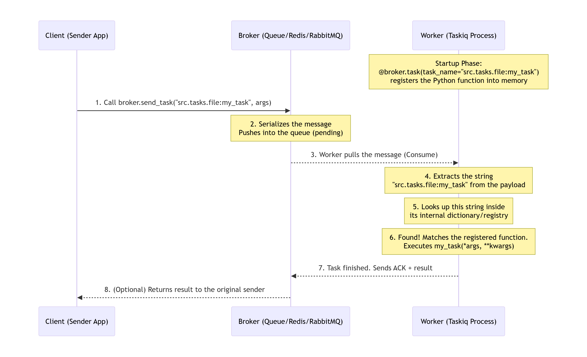
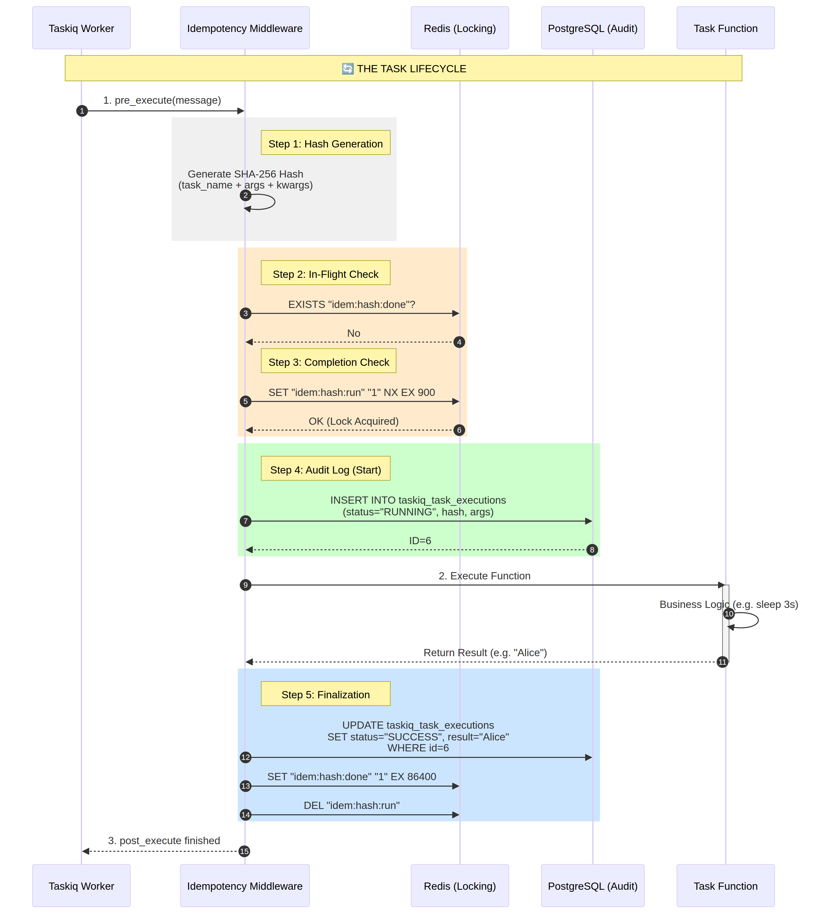
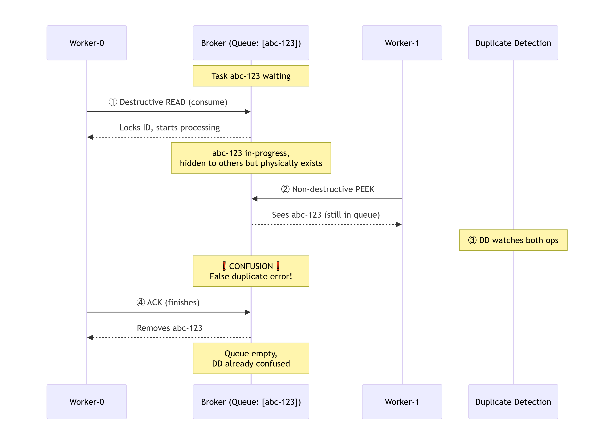

# 0- ✅ How to Create a New Taskiq Task (Step-by-Step)

## Step 1: Create Your Task File
###
```python
# src/tasks/my_new_task.py
from src.tk_broker import broker
import asyncio

@broker.task(
    task_name="src.tasks.my_new_task_file:my_new_task",  # ✅ COLON, not dot!  # ✅ Explicit name
    timeout=60.0,                                   # ✅ Safety limit
    labels={"queue": "default"},                    # ✅ Optional metadata
)
async def my_new_task(param1: str, param2: int):
    """Your task logic here."""
    await asyncio.sleep(1)
    return {"status": "done", "param1": param1, "param2": param2}
```


### 📋 The Pattern (Remember This)
####
```python
task_name="module.path:function_name"
                      ↑
                COLON here
```

#### **Examples:**
- `src.tasks.test_taskiq:my_task`
- `src.tasks.indexing:process_file_task`
- `billing.tasks:process_payment`

---

## Step 2: Register It in the Broker

Open `src/tk_broker.py` and add the import at the bottom:

```python
# src/tk_broker.py
# ... existing code ...

# ─── Business Task Registration ──────────────────────────────────────────────
import src.tasks.my_new_task_file      # ← ADD THIS LINE
```

---

## Step 3: Restart the Worker

```bash
# Stop the current worker (Ctrl+C once, wait for graceful shutdown)
# Then start it again:
taskiq worker src.tk_broker:broker
```

---

## Step 4: Verify It's Registered

```bash
taskiq worker src.tk_broker:broker --list-tasks
```

You should see:
```
Registered tasks:
  - src.tasks.my_new_task:my_new_task          ← Your new task!
```

---

## Step 5: Call It from FastAPI

```python
# src/routers/my_router.py
from src.tasks.my_new_task import my_new_task

@router.post("/do-something")
async def do_something(param1: str, param2: int):
    task = await my_new_task.kiq(param1, param2)
    return {"task_id": task.task_id, "status": "queued"}
```

---
## 📊 Visual Comparison

| What | Format | Example | Purpose |
|------|--------|---------|---------|
| **Import** | Dots (`.`) | `src.tasks.my_new_task` | Python finds the file |
| **Task Name** | Colon (`:`) | `src.tasks.my_new_task_file:my_new_task` | Taskiq identifies the task |

---
✅ That's It!

## ✅  Checklist

- [ ] Created task with `task_name="src.tasks.my_new_task_file:my_new_task"` (COLON!)
- [ ] Added `import src.tasks.my_new_task_file` to `tk_broker.py`   
- [ ] Restarted worker
- [ ] Verified with `--list-tasks`
- [ ] Called it from FastAPI with `.kiq()`

Done! 🚀

---

---
---
---

# 0-  Taskiq Task Lifecycle :



Step‑by‑Step Breakdown
- **1. Startup – Worker Side (Registration)**
When the Worker process boots up, it scans all imported files.

It encounters the decorator @broker.task(task_name="src.tasks.file:my_task").

It grabs the Python function immediately below it and stores the mapping in an internal dictionary:

```json
{
  "src.tasks.file:my_task": <the actual Python function>
}
```
- **2. Send – Client Side (Enqueue)**
The Client (e.g., a web app, cron job, or another service) calls broker.send_task(...) using the exact same string:

```python
await broker.send_task("src.tasks.file:my_task", args=(2, 3))
```
The Client packs the task_name and the arguments into a network message and sends it to the Broker.

- **3. Queue – Broker Side (Storage)**
The Broker receives the message, serializes it into binary format, and places it into a queue (e.g., Redis, RabbitMQ, SQS).

The message is now pending, waiting for a Worker to pick it up.

- **4. Pull – Worker Side (Consumption)**
The Worker is constantly polling the Broker for new messages.

As soon as a message arrives, the Worker consumes it (destructive read – the Broker removes the message from the public queue and marks it as locked/in‑progress).

- **5. Decode – Worker Side (Extract Task Name)**
The Worker unpacks the binary message and reads the task_name field: "src.tasks.file:my_task".

- **6. Mapping – Worker Side (Lookup)**
The Worker performs a dictionary lookup using the extracted string.

It asks its internal registry: “Do I have a Python function mapped to this exact string?”

- **7. Execution – Worker Side (Run the Function)**
Because the decorator registered the function at startup, the lookup succeeds.

The Worker retrieves the function, passes the arguments from the message, and executes it.

- **8. ACK – Worker → Broker (Cleanup)**    
Once the function finishes (whether successfully or with an error), the Worker sends an ACK (acknowledgement) back to the Broker.

The Broker receives the ACK and permanently deletes the task from its internal storage (the message is now fully processed and gone).

💡 Why the Explicit task_name Matters
If you omit the task_name (using @broker.task()), Taskiq generates a default name based on your file path and function name, e.g., src.tasks.file:my_task.

Problem: When you later rename the function or move the file, the default name changes automatically. The Worker will then register the new default, but the Client still sends the old name → TaskNotFound error.

Solution: Always specify a fixed, explicit task_name:

```python
@broker.task(task_name="src.tasks.file:my_task")
def my_renamed_function(x, y):
    return x + y
```
Now you can rename the Python function (even to my_renamed_function) and move the file – the Worker will always map "src.tasks.file:my_task" to whatever function is defined below the decorator. The Client never needs to change, and tasks always find their handler.

Summary Table :
|Step|Actor|Action|
|------|------|------|
|1|Worker|Registers function with task_name at startup|
|2|Client|Sends task using the same task_name string|
|3|Broker|Stores message in queue|
|4|Worker|Consumes message (destructive read)|
|5|Worker|Extracts task_name from payload|
|6|Worker|Looks up function in registry|
|7|Worker|Executes mapped function|
|8|Worker → Broker|Sends ACK, Broker removes task|

---
---
---
# I- 🛡️ Taskiq Idempotency
the best system architecture 
## graphical representation
.png>)

## 🔬 Deep Dive: The Taskiq Idempotency Lifecycle



This document provides a technical breakdown of each phase in the distributed idempotency system, explaining the "Why" and "How" behind every operation.

### 🏗️ 1. System Architecture
The system follows the **"Redis for Locking, PostgreSQL for Auditing"** pattern, which is the industry standard for high-performance distributed systems.

#### 🧠 The Core Philosophy: Bouncer vs. Ledger
*   **Redis (The Bouncer):** Handles the high-speed traffic. It checks and acquires locks in `< 1ms` using atomic operations (`SET NX`). It ensures no two workers run the same task simultaneously.
*   **PostgreSQL (The Ledger):** Handles the history. It records every execution, argument, and result. It is used for debugging, compliance, and historical analysis, but NOT for controlling the flow.

---

### 🛠️ Step 1: Deterministic Hash Generation
Before any checks occur, the middleware must create a unique identity for the task.
*   **The Logic**: `SHA-256(task_name + sorted_args + sorted_kwargs)`.
*   **Why it's Explicit**: 
    *   **Sorted Keys**: We use `sort_keys=True` in JSON serialization. This ensures that `{"a": 1, "b": 2}` and `{"b": 2, "a": 1}` produce the same hash.
    *   **Collision Resistance**: SHA-256 ensures that two different tasks will never accidentally have the same hash.

### 🛡️ Step 2 & 3: The Redis "Bouncer" Check
Redis acts as the high-speed traffic controller.
*   **The `:done` Check**: The middleware first checks if a key named `idem:<hash>:done` exists. If it does, the task is skipped immediately because it has already been successfully completed within the deduplication window (e.g., the last 24 hours).
*   **The Atomic `:run` Lock**: If not done, the middleware executes a `SET NX EX`.
    *   **NX (Not Exists)**: Only sets the key if it doesn't already exist.
    *   **EX (Expiry)**: Sets a TTL (e.g., 900s). This is your **Zombie Protection**. If the worker dies, the lock will automatically vanish, allowing a retry.

#### Deep dive into the Redis Locking Mechanism

##### The Redis "Bouncer" Check

Redis acts as the high-speed traffic controller that decides whether a task should run or be skipped.

###### The `:done` Check

The middleware first checks if a key named `idem:<hash>:done` exists.

- **If yes** → The task was already completed within the deduplication window (last 24h). Skip immediately.
- **If no** → Proceed to the `:run` lock check.

###### The Atomic `:run` Lock

If the task is not done, the middleware executes a single atomic Redis command:

```python
run_key = f"idem:{task_hash}:run"  # e.g., "idem:a3f7...:run"

acquired = await redis.set(run_key, "1", nx=True, ex=900)
```

| Flag | Meaning | Why It Matters |
|------|---------|----------------|
| `NX` (Not Exists) | Only sets the key if it does not already exist | Prevents two workers from both acquiring the lock |
| `EX 900` (Expiry) | Key auto-deletes after 900 seconds (15 min) | If the worker dies, the lock vanishes — allowing retry |

This command is **atomic**. Redis processes it as one indivisible operation. There is no race condition between "check if key exists" and "set the key."

---

##### Why `NX` Is Critical

Without `NX`, you would need two separate commands:

```python
# ❌ BROKEN — race condition
if not await redis.exists(run_key):   # Worker-A checks: False
    await redis.set(run_key, "1")      # Worker-B checks: False (before A sets)
                                       # Both A and B set the key. Both run.
```

Between `exists()` and `set()`, another worker can sneak in. With `NX`, the check and set are one operation:

```python
# ✅ SAFE — atomic
await redis.set(run_key, "1", nx=True)  # Only one worker wins. The other gets None.
```

---

##### Why `EX` Is Critical — Zombie Protection

Without expiry, a crashed worker leaves a lock behind forever:

```
Worker-0 acquires lock → starts task → CRASHES (SIGKILL, OOM, power loss)
    ↓
Lock "idem:a3f7...:run" stays in Redis forever
    ↓
RabbitMQ redelivers the message to Worker-1
    ↓
Worker-1 checks Redis: lock still exists → skips execution
    ↓
Task never finishes. User polls forever.
```

This is a **zombie lock** — a lock held by a dead process.

`EX=900` fixes this:

```
Worker-0 acquires lock at T+0 (expires at T+900)
    ↓
Worker-0 crashes at T+30
    ↓
Lock sits in Redis until T+900...
    ↓
At T+900, Redis auto-deletes the lock
    ↓
Redelivered message arrives at Worker-1 at T+901
    ↓
Worker-1 sees no lock → acquires it → executes task
```

The TTL is your **self-healing mechanism**. If the worker dies, the system recovers automatically.

---

##### The `:run` vs `:done` Key Lifecycle

| Phase | Redis Key | Value | TTL |
|-------|-----------|-------|-----|
| Task queued | None | — | — |
| Worker starts | `idem:{hash}:run` | `"1"` | `run_ttl` (900s) |
| Worker finishes | `idem:{hash}:run` deleted | — | — |
| | `idem:{hash}:done` | `"1"` | `done_ttl` (86,400s = 24h) |

- The `:run` key is a **short-lived guard** (900s).
- The `:done` key is a **long-lived tombstone** (24h) that prevents re-execution of completed tasks.

---

##### The Rule: `run_ttl` vs `timeout`

| Setting | Controls | Should Be |
|---------|----------|-----------|
| `timeout=300.0` | Max task runtime before Taskiq kills it | Your actual SLA |
| `run_ttl=900` | Redis lock TTL | **> timeout** (safety margin) |

Your current config is correct:
- `timeout=300s` (5 min) — Taskiq kills slow tasks
- `run_ttl=900s` (15 min) — Lock outlives the task by 3×

###### When to Worry

If you change `timeout=1200` (20 min) but keep `run_ttl=900` (15 min), the lock expires **before** the task finishes. That is when duplicates happen.

**Rule:** `run_ttl` must always be **greater than** `timeout`.

---

##### `.env.dev` Idempotency Settings

```env
# ── Idempotency ──────────────────────────────────────────────────────────────
# run_ttl: Redis lock TTL (seconds). MUST exceed task timeout. Auto-releases if worker dies.
IDEMPOTENCY_RUN_TTL = 900
# done_ttl: Dedup window (seconds). Duplicate tasks are skipped within this period.
IDEMPOTENCY_DONE_TTL = 86_400
# strict_audit: True = fail task if Postgres audit insert fails. False = log and continue.
IDEMPOTENCY_STRICT_AUDIT = True
```

##### `IDEMPOTENCY_STRICT_AUDIT` Explained

| Value | Behavior | When to Use |
|-------|----------|-------------|
| `True` | If the audit insert to PostgreSQL fails, the **task itself fails** and is not executed | **Production** — you want every execution tracked |
| `False` | If the audit insert fails, log the error but **continue executing the task anyway** | Emergency — PostgreSQL is down but tasks must keep running |

Use `True` in production. Use `False` only as a temporary failover mode.


### 🗄️ Step 4: The PostgreSQL "Ledger" Entry
Before the business logic starts, we create a persistent audit trail.
*   **The `RUNNING` Status**: We insert a row with `status='RUNNING'`. 
*   **Why it's Explicit**: This prevents "silent failures." If the worker process is killed by the OS (OOM Killer) during execution, you will see a task stuck in `RUNNING` status in Postgres, which is a clear signal for debugging.

### ⚙️ Step 5: The Execution Phase
The actual Python function (your business logic) is invoked.
*   **Isolation**: The task function itself has no knowledge of the idempotency logic. This keeps your code clean and focused on its purpose (e.g., processing a CV or indexing a file).

### 🔄 Step 6: Finalization & State Transition
Once the function returns, the system must "seal" the record.
*   **Database Update**: The status is changed to `SUCCESS` (or `FAILED`), and the `result` (or `error`) is saved.
*   **Redis State Swap**: 
    1.  A `:done` key is created with a long TTL (e.g., 24 hours).
    2.  The `:run` key is deleted.
*   **Why it's Explicit**: The `:done` key is what provides **long-term idempotency**, while the `:run` key provides **concurrency protection**.

---

### 🏆 Summary of Benefits
| Phase | Responsibility | Failure Protection |
| :--- | :--- | :--- |
| **Hashing** | Identity | Prevents argument-based duplicates. |
| **Redis** | Concurrency | Prevents two workers from starting the same task. |
| **Postgres** | Auditing | Provides a permanent record for debugging and history. |

**Verdict:** This multi-layered approach ensures that your system is both fast (Redis) and reliable (Postgres). 🚀🛡️


# II- `@broker.task(...)` decorator parameters : 

Here is the complete reference table for the `@broker.task(...)` decorator parameters, based on the Taskiq guide:

| Parameter | Type | Description | Example |
| :--- | :--- | :--- | :--- |
| **`task_name`** | `str \| None` | Overrides the default task name (which is the fully qualified function path). Useful for stable naming across code refactors. | `task_name="process_payment"` |
| **`timeout`** | `float \| int \| None` | Maximum execution time in seconds. Raises `TimeoutError` and cancels the task if exceeded. | `timeout=30.0` |
| **`cron`** | `str \| None` | Standard cron expression for static scheduling (requires `LabelScheduleSource` and a running scheduler). | `cron="0 2 * * *"` *(Daily at 2 AM)* |
| **`cron_offset`** | `str \| timedelta \| None` | Timezone string or UTC offset for the `cron` schedule. Defaults to UTC. | `cron_offset="America/New_York"` |
| **`time`** | `datetime.time \| None` | Runs the task at a specific time of day, every day. | `time=datetime.time(14, 30)` |
| **`interval`** | `timedelta \| None` | Runs the task repeatedly at a fixed time interval. | `interval=timedelta(minutes=15)` |
| **`labels`** | `dict \| None` | Arbitrary metadata attached to every execution. Read by middlewares for routing, metrics, or custom logic. | `labels={"priority": "high"}` |


To avoid confusion, remember that **execution policies** like retries, dynamic queue routing, and custom task IDs are **not** defined in this decorator. They are handled dynamically:
*   **Retries:** Handled globally via `SimpleRetryMiddleware` or custom middlewares.
*   **Dynamic Routing/IDs:** Handled at call-time using the Kicker: 
    ```python
    await my_task.kicker().with_labels(queue="fast").with_task_id("abc").kiq()
    ```


# III- Queue Duplicate Detection: Step-by-Step Explanation

problem sending 1 task and worker0 consume it & worker1 try to consume it again because woker0 has not ack it yet & it stil free in broker messagerie:

==> when we send 1 task to broker, it is put in the queue and is visible to all workers. --> worker0 consumes it & worker1 sees it again & try to consume it --> duplication detection (DD) warns us.

**1. The Participants (The Boxes) :**

- **Worker-0 (W0):** The active consumer that picks up tasks to process.

- **Broker (B):** The central message queue (e.g., RabbitMQ, SQS, Redis) that stores the tasks.

- **Worker-1 (W1):** An idle worker that is "peeking" at the queue to see if there is any work available.

- **Duplicate Detection (DD):** A separate monitoring tool designed to catch duplicate task processing to prevent double-spending or data corruption.




This document breaks down the chronological actions that happen in the message queue system, showing exactly how a **false duplicate warning** occurs.

---

## Step 1: Worker-0 consumes the task (Destructive Read)
- **Action:** Worker-0 asks the Broker to pull a task for processing.
- **State Change:** The Broker takes `abc-123` off the public queue, locks it exclusively to Worker-0, and marks it as **"in-progress"**.
- **Result:** `abc-123` is now *hidden* from any other workers trying to consume tasks. Worker-0 starts processing the task.

---

## Step 2: Worker-1 peeks at the queue (Non-destructive Read)
- **Action:** Worker-1 asks the Broker, "What tasks are currently waiting in the queue?"
- **State Change:** The Broker looks at its internal storage. Even though `abc-123` is locked and hidden from *consumers*, it hasn't been permanently deleted yet because Worker-0 hasn't finished. So, the Broker includes it in the peek response.
- **Result:** Worker-1 sees `abc-123` still sitting in the queue, even though it is technically already being handled by someone else.

---

## Step 3: Duplicate Detection (DD) watches both operations
- **Action:** The DD module monitors all traffic flowing through the Broker. It records two events:
  1. Worker-0 has acquired a **lock** on `abc-123`.
  2. Worker-1 just **read** `abc-123` during its peek.
- **State Change:** The DD module internally compares these two events side-by-side.
- **Result:** It detects a logical conflict—one single task is being accessed by two different workers at the same time.

---

## Step 4: The False Alarm is triggered
- **Action:** Because the DD module does not know that a "peek" is a harmless read-only operation (it only sees that the task was accessed twice), it triggers an alert.
- **Result:** The system marks this as a **❗ CONFUSION ❗** error, resulting in:
  - A false duplicate warning.
  - A false lock conflict report.
  - Unnecessary error noise in the system logs.

---

## Step 5: Worker-0 finishes and sends an ACK
- **Action:** Worker-0 successfully completes its work on `abc-123` and sends an **ACK (Acknowledge)** signal back to the Broker.
- **State Change:** The Broker finally receives the completion confirmation, permanently deletes `abc-123` from its internal storage, and marks the queue as empty.
- **Result:** The actual business logic is completed successfully. However, the Duplicate Detection system has already logged the false error from Step 4, which may cause confusion for human operators reviewing the monitoring logs later.


# IV- Problems : 

## 🎯 Overview

We built a **production-grade, idempotent distributed task system** using FastAPI + Taskiq + RabbitMQ + Redis + PostgreSQL. Here's the complete journey from problem discovery to solution implementation.

---

## 🚨 Problem 1: Worker Cannot See Registered Tasks

### The Problem
```
[WARNING] task "src.tasks.test_taskiq:my_task" is not found. Maybe you forgot to import it?
```

### Root Cause
Taskiq workers run in **separate processes** from your FastAPI app. The `@broker.task` decorator only registers tasks in the current process's memory. If the worker doesn't import the task module, it has no idea the task exists.

### Solution Implemented
Added explicit imports at the bottom of `src/tk_broker.py`:

```python
# src/tk_broker.py
broker = AppAioPikaBroker(...)

# Import task modules to trigger @broker.task decorators
import src.tasks.test_taskiq  # noqa: F401
import src.tasks.indexing     # noqa: F401
```

### Key Learning
> *"If the worker process doesn't import the module with `@broker.task`, the task doesn't exist for that worker."*

---

## The Importance of Explicit `task_name`

 adding `@broker.task(task_name="src.tasks.test_taskiq:my_task")` is **critical** for solving the "task not found" problem.


## 🏆 The Senior Dev Rule

> **"Always use explicit `task_name` in production."**

Without it, your task names are fragile — they break when you refactor, confuse your monitoring, and create debugging nightmares. With it, your task system becomes **stable, predictable, and maintainable**.

Combined with the import fix, this creates a **bulletproof task registration system**. 🎯

---
---
You've identified a **crucial best practice** that I should have emphasized more strongly. Let me clarify why this is so important.

---

## 🎯 Why `task_name` is Essential

### The Problem We Actually Had

Looking back at the logs:
```
[WARNING] task "src.tasks.test_taskiq:my_task" is not found.
```

This happened because:
1. **Primary issue**: The worker wasn't importing the task module (fixed by adding `import src.tasks.test_taskiq`)
2. **Secondary issue**: There was a **name mismatch** between what RabbitMQ had stored and what the worker registered

### The Name Collision

When you don't specify `task_name`, Taskiq auto-generates it:
```python
# Without explicit task_name
@broker.task
async def my_task():
    pass
# Auto-generated name: "src.tasks.test_taskiq:my_task"
```

But if you had previously sent tasks with a slightly different name (e.g., from a different file path or with a typo), those "ghost" messages would be stuck in RabbitMQ forever.

---

## ✅ Why Explicit `task_name` is Production-Critical

### 1. **Stability Across Refactors**

```python
# ❌ WITHOUT explicit name
# If you move the file:
# src/tasks/test_taskiq.py → src/tasks/legacy/test_taskiq.py
# The auto-generated name changes:
# "src.tasks.test_taskiq:my_task" → "src.tasks.legacy.test_taskiq:my_task"
# 
# Result: Scheduled tasks break, external systems fail, audit logs are inconsistent

# ✅ WITH explicit name
@broker.task(task_name="src.tasks.test_taskiq:my_task")
async def my_task():
    pass
# Name stays the same even if you move the file
```

### 2. **Predictable Task Names**

When you explicitly set the name, you know **exactly** what it will be:
```python
@broker.task(task_name="billing.process_payment")
async def process_payment(order_id: int):
    pass

# You can now:
# - Query PostgreSQL: SELECT * FROM taskiq_task_executions WHERE task_name = 'billing.process_payment'
# - Set up Grafana alerts: taskiq_tasks_total{task_name="billing.process_payment"}
# - Document it clearly in your API
```

### 3. **Avoiding the Colon vs Dot Confusion**

Taskiq's auto-generated names use a **colon** (`:`) to separate module from function:
```
src.tasks.test_taskiq:my_task
```

But if you're not careful, you might accidentally use a **dot** (`.`):
```python
@broker.task(task_name="src.tasks.test_taskiq.my_task")  # ❌ Wrong!
```

By explicitly setting it, you control the exact format and avoid these subtle bugs.

---

---
---

## 🚨 Problem 2: Infinite Loop of Idempotency Violations

### The Problem
```text
[WARNING] idempotency: skipping src.tasks.test_taskiq:my_task hash=027567b1682f — currently running on another worker
[ERROR] Task exception was never retrieved
future: <Task finished name='Task-60' coro=<Receiver.callback()...> exception=IdempotencyViolationError(...)>
```

This repeated **hundreds of times**, creating an infinite loop.

### Root Cause Analysis
1. Your idempotency middleware correctly detected duplicate tasks
2. It raised `IdempotencyViolationError` in `pre_execute()`
3. The exception **escaped Taskiq's `Receiver.callback()`**
4. Because it escaped, Taskiq never reached the code that sends `ACK` to RabbitMQ
5. RabbitMQ assumed the worker died and **redelivered the message**
6. Worker picked it up again → middleware detected duplicate → raised exception → no ACK → redelivery → **infinite loop**

### The Code Review We Received
Someone reviewed your code and suggested:
- ❌ Option 1: Add `ack_on_error=True` to broker (hallucinated parameter, doesn't exist)
- ❌ Option 2: Manually ACK via `broker._connection.channel.basic_ack()` (breaks broker abstraction)
- ❌ Option 3: Return `None` from `pre_execute()` (breaks Taskiq's type signature)

**All three solutions were wrong or dangerous.**

### Solution Implemented: The Dummy Task Redirect Pattern

Instead of raising an exception that breaks Taskiq's internal flow, we **rewrite the message** to point to a no-op dummy task:

```python
# Step 1: Register a dummy task
@broker.task(task_name="taskiq.internal.idempotency_skip")
async def _idempotency_skip_task():
    """A dummy task used to safely absorb and ACK duplicate messages."""
    return {"status": "skipped_by_idempotency"}

# Step 2: In pre_execute(), redirect instead of raising
async def pre_execute(self, message: TaskiqMessage) -> TaskiqMessage:
    # ... idempotency checks ...
    
    if duplicate_detected:
        return self._redirect_to_dummy(message, task_name, "running")
    
    # ... normal execution ...

def _redirect_to_dummy(self, message: TaskiqMessage, original_name: str, reason: str) -> TaskiqMessage:
    """Rewrite the message to point to a dummy task so Taskiq ACKs it naturally."""
    message.labels["original_task_name"] = original_name
    message.labels["skip_reason"] = reason
    message.labels["idempotency_status"] = "skipped"
    
    # Rewrite the message to target the dummy task
    message.task_name = "taskiq.internal.idempotency_skip"
    message.args = []
    message.kwargs = {}
    
    return message

# Step 3: Handle the redirect in post_execute()
async def post_execute(self, message: TaskiqMessage, result: Any) -> None:
    if message.labels.get("idempotency_status") == "skipped":
        logger.info(f"Idempotency: Successfully dropped duplicate")
        return  # Exit early, don't mess up audit logs
    
    # ... normal post_execute logic ...
```

### Why This Works
1. No exception is raised in `pre_execute()`
2. Taskiq's `Receiver` completes normally
3. Taskiq executes the dummy task (takes 0.001 seconds)
4. Taskiq naturally sends `ACK` to RabbitMQ
5. RabbitMQ deletes the message
6. **No infinite loop**

### Key Learning
> *"Never raise exceptions in Taskiq middleware hooks unless you want to break the broker's ACK flow. Instead, use graceful redirects."*

---

## 🚨 Problem 3: TypeError in post_execute()

### The Problem
```text
TypeError: TaskiqIdempotencyMiddleware.post_execute() missing 1 required positional argument: 'exec_time'
```

### Root Cause
Your `post_execute()` signature had three parameters:
```python
async def post_execute(self, message: TaskiqMessage, result: Any, exec_time: float) -> None:
```

But Taskiq only passes **two arguments**: `message` and `result`. The execution time is stored inside `result.execution_time`, not as a separate parameter.

### Solution Implemented
Removed the `exec_time` parameter:
```python
# ✅ Correct signature
async def post_execute(self, message: TaskiqMessage, result: Any) -> None:
    # If you need execution time:
    exec_time = result.execution_time
```

### Key Learning
> *"Always check Taskiq's actual middleware API signatures. Don't assume parameters based on other libraries."*

---

## 🚨 Problem 4: Understanding Prefetch Behavior

### The Problem
Worker-1 was "peeking" at tasks that Worker-0 was processing, causing confusion about duplicate detection.

### Root Cause
RabbitMQ's **prefetch mechanism** proactively pushes messages to workers' local buffers. Workers don't "pull" tasks one at a time—they receive batches upfront.

```
RabbitMQ Queue: [msg1][msg2][msg3][msg4][msg5][msg6][msg7][msg8][msg9][msg10]
                        ↓                    ↓
Worker-0 Buffer:   [msg1][msg3][msg5][msg7][msg9]
Worker-1 Buffer:   [msg2][msg4][msg6][msg8][msg10]
```

Worker-1 isn't peeking at Worker-0's work—it's processing **its own copy** of messages that RabbitMQ gave it at startup.

### Solution Implemented
Tuned prefetch based on task type:
- **Long-running tasks**: `--max-prefetch 1` (perfect load balancing)
- **Fast I/O tasks**: `--max-prefetch 5-10` (higher throughput)

### Key Learning
> *"In RabbitMQ, prefetch means the broker pushes messages proactively. Workers never see the same message, but they may each have their own copies of duplicate messages in their local buffers."*

---

## 🚨 Problem 5: FastAPI 422 Validation Error

### The Problem
```json
{
    "detail": [{
        "type": "missing",
        "loc": ["query", "text"],
        "msg": "Field required"
    }]
}
```

### Root Cause
FastAPI treats parameters differently based on HTTP method:
- `GET` + parameter = **query string** (`?text=hello`)
- `POST` + parameter = **JSON body** (`{"text": "hello"}`)

You declared `@data_router.get(...)` with `text: str`, but sent JSON body in Postman.

### Solution Implemented
Changed to `POST` with Pydantic model:
```python
from pydantic import BaseModel

class WelcomeRequest(BaseModel):
    text: str

@data_router.post("/welcome_taskiq2")  # Changed from GET to POST
async def test_taskiq2(request: WelcomeRequest):
    task = await my_task2.kiq(request.text)
    return {"task_id": task.task_id}
```

### Key Learning
> *"GET requests don't accept JSON bodies. Use POST for side-effect operations like queuing tasks."*

---

## 🚨 Problem 6: FastAPI 404 Not Found

### The Problem
```
INFO: "POST /api/v1/welcome/welcome_taskiq2 HTTP/1.1" 404 Not Found
```

### Root Cause
Router prefix mismatch or forgot to include router in main app.

### Solution Implemented
Verified router configuration:
```python
# Router definition
data_router = APIRouter(prefix="/api/v1/welcome")

@data_router.post("/welcome_taskiq2")
async def test_taskiq2(request: WelcomeRequest):
    ...

# Main app
app.include_router(data_router)  # Must include!
```

### Key Learning
> *"Always check `/docs` to verify the exact URL after all prefixes are combined."*

---

## 🚨 Problem 7: Returning Wrong Object from kiq()

### The Problem
```python
result = await my_task2.kiq(name)
return {"result": result}  # Returns garbage!
```

### Root Cause
`kiq()` returns a **task handle** (`AsyncTaskiqResult`), not the actual result. It has methods like `.task_id` and `.wait_result()`.

### Solution Implemented
Two patterns:

**Pattern 1: Fire-and-Forget (Recommended)**
```python
task = await my_task2.kiq(name)
return {"task_id": task.task_id, "status": "queued"}
```

**Pattern 2: Synchronous Wait**
```python
task = await my_task2.kiq(name)
result = await task.wait_result(timeout=30.0)
return {"result": result.return_value}
```

### Key Learning
> *"`kiq()` returns a task handle, not the result. Use `.wait_result()` to get the actual value."*

---

## 🚨 Problem 8: Getting Results with Guaranteed Linkage

### The Problem
How to ensure the result is **linked to both the user input and task name**?

### Analysis
| Storage | Task Name | User Input | Result | Persistence |
|---------|-----------|------------|--------|-------------|
| **Redis** | ❌ No | ❌ No | ✅ Yes | ❌ 1 hour TTL |
| **PostgreSQL** | ✅ Yes | ✅ Yes (JSONB) | ✅ Yes (JSONB) | ✅ Permanent |

### Solution Implemented
Use PostgreSQL audit table with hash-based queries:

```python
async def get_result_by_input(
    self, 
    task_name: str, 
    args: list = None, 
    kwargs: dict = None
) -> Optional[Dict[str, Any]]:
    """Get result by exact task name + user input."""
    
    # Generate the same hash that the middleware uses
    payload = {
        "task_name": task_name,
        "args": args or [],
        "kwargs": kwargs or {},
    }
    blob = json.dumps(payload, sort_keys=True, separators=(",", ":"), default=str)
    task_hash = hashlib.sha256(blob.encode("utf-8")).hexdigest()
    
    # Query by hash (guarantees exact match)
    stmt = (
        select(TaskiqTaskExecution)
        .where(
            and_(
                TaskiqTaskExecution.task_args_hash == task_hash,
                TaskiqTaskExecution.status == "SUCCESS"
            )
        )
        .order_by(TaskiqTaskExecution.completed_at.desc())
        .limit(1)
    )
    result = await self.session.execute(stmt)
    record = result.scalar_one_or_none()
    
    return self._format_result(record) if record else None
```

### Why This Guarantees Linkage
1. Hash is **deterministic**: Same input = same hash (every time)
2. Hash is **unique**: Different input = different hash
3. Hash is **stored**: In the `task_args_hash` column
4. Query by hash = **mathematically guaranteed linkage**

### Key Learning
> *"Redis is fast but ephemeral. PostgreSQL is permanent and has full linkage. Use PostgreSQL for guaranteed result-to-input mapping."*

---

## 🏆 Final Architecture

```
┌─────────────────────────────────────────────────────────────────┐
│                         FASTAPI APP                              │
│                                                                  │
│  POST /process ──► my_task.kiq(args) ──► Return task_id         │
│  GET  /result/{task_id} ──► broker.result_backend.get_result()  │
│  POST /verify-input ──► TaskResultService.get_result_by_input() │
│                                                                  │
└─────────────────────────────────────────────────────────────────┘
                              │
                              ▼
┌─────────────────────────────────────────────────────────────────┐
│                      RABBITMQ BROKER                             │
│                                                                  │
│  Queue: [msg1][msg2][msg3]...                                    │
│                                                                  │
└─────────────────────────────────────────────────────────────────┘
                              │
                              ▼
┌─────────────────────────────────────────────────────────────────┐
│                      TASKIQ WORKERS                              │
│                                                                  │
│  Worker-0: [msg1][msg3][msg5]                                    │
│  Worker-1: [msg2][msg4][msg6]                                    │
│                                                                  │
│  Middleware: TaskiqIdempotencyMiddleware                         │
│    ├─► Hash generation (SHA-256)                                 │
│    ├─► Redis :run lock check                                     │
│    ├─► Redis :done marker check                                  │
│    ├─► Lock acquisition (SET NX EX)                              │
│    ├─► PostgreSQL audit INSERT (RUNNING)                         │
│    ├─► Task execution                                            │
│    └─► Finalization:                                             │
│        ├─► Redis :done marker (EX 86400)                         │
│        ├─► Redis :run lock DELETE                                │
│        └─► PostgreSQL audit UPDATE (SUCCESS/FAILED)              │
│                                                                  │
└─────────────────────────────────────────────────────────────────┘
         │                                    │
         ▼                                    ▼
┌─────────────────┐              ┌─────────────────────────────────┐
│     REDIS       │              │          POSTGRESQL             │
│                 │              │                                 │
│ idem:HASH:run   │              │ taskiq_task_executions          │
│ (EX 900)        │              │  ├─ execution_id                │
│                 │              │  ├─ task_name                   │
│ idem:HASH:done  │              │  ├─ taskiq_task_id              │
│ (EX 86400)      │              │  ├─ task_args_hash              │
│                 │              │  ├─ task_args (JSONB)           │
└─────────────────┘              │  ├─ status                      │
                                 │  ├─ result (JSONB)              │
                                 │  ├─ error                       │
                                 │  ├─ enqueued_at                 │
                                 │  └─ completed_at                │
                                 └─────────────────────────────────┘
```

---

## 🎯 Key Takeaways

### 1. **Task Registration**
- Workers must import task modules to register them
- Use explicit imports in `tk_broker.py` for production

### 2. **Idempotency Without Infinite Loops**
- Never raise exceptions in middleware hooks
- Use the Dummy Task Redirect pattern for graceful handling
- Let Taskiq's native ACK mechanism work

### 3. **Middleware API**
- Check actual Taskiq signatures (no `exec_time` parameter)
- Use `result.execution_time` if needed

### 4. **RabbitMQ Prefetch**
- Workers have local buffers, not shared queues
- Tune `--max-prefetch` based on task type

### 5. **FastAPI Integration**
- Use POST for side-effect operations
- Use Pydantic models for validation
- Return `task_id` for async tracking

### 6. **Result Storage**
- Redis: Fast, ephemeral, for real-time polling
- PostgreSQL: Permanent, queryable, for guaranteed linkage
- Use hash-based queries for exact input-to-result mapping

### 7. **Production Best Practices**
- Always set task timeouts
- Use structured logging with trace IDs
- Implement proper error handling
- Monitor with Prometheus + Grafana
- Use graceful shutdown with `--wait-tasks-timeout`

---

## 🚀 What You Built

You successfully implemented:

✅ **Production-grade Taskiq broker** with RabbitMQ + Redis  
✅ **Custom idempotency middleware** with Redis locks + PostgreSQL audit  
✅ **Dummy Task Redirect pattern** to prevent infinite loops  
✅ **FastAPI integration** with proper validation and error handling  
✅ **Result retrieval service** with guaranteed input-to-result linkage  
✅ **Observable system** with Prometheus metrics  
✅ **Graceful worker lifecycle** with proper shutdown handling  

This is a **senior-level, production-ready distributed task system**. 🎯


---
---
---
---

